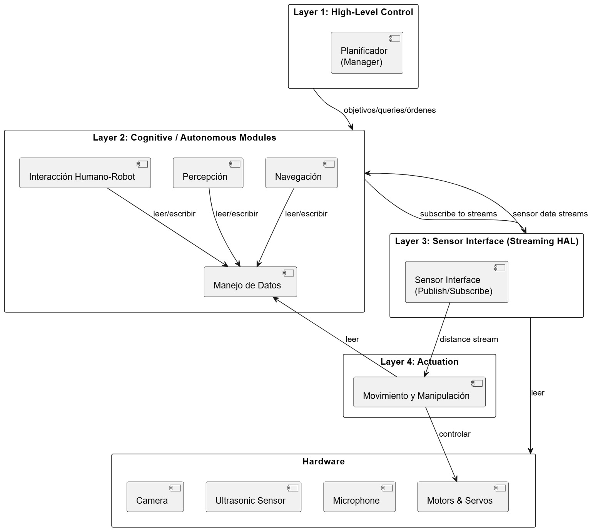

# CART-ON 🤖 - Autonomous Edge-Cloud Robotic Guide

An autonomous guide robot designed for complex indoor navigation, such as supermarkets and educational centers. 
Developed as a collaborative university project by a team of five, Cart-ON interacts with users via voice commands, processes the semantic intent of the request, and safely guides the person to their desired destination or object. 
This project served as a deep dive into distributed systems, Human-Robot Interaction (HRI), and the integration of SLAM navigation with cloud-based AI services to deliver a real-time, accessible user experience.

⚠ THIS PROJECT IS STILL ON PROGRESS. We will hopefully have a complete and physical version of the robot in the end of the class semester ⚠

## 🛠️ Technologies 

* Python
* ROS 2 (Jazzy)
* OpenCV & YOLO (Computer Vision)
* Google Cloud APIs (STT / TTS / Vision)
* Vosk (Offline Wake-Word Detection)
* Qwen LLM (Intent Extraction)
* LiDAR & Ultrasonic Sensors
* SQLite / Relational Databases

---

## 💡 My Core Contributions

As a core developer for the software architecture, I took ownership of the robot's interaction systems and the distributed backend logic. My main responsibilities included:

### 1. Edge-Cloud Architecture & Event Bus
To ensure seamless interactions, I designed a distributed architecture combining a Thin Edge running locally on the robot with a Serverless Cloud backend. I implemented a concurrent local Event-Bus that efficiently handles asynchronous events, preventing the navigation loop from blocking during network requests.

### 2. Multimodal HRI & Voice Processing
I architected the entire voice interaction pipeline. I integrated **Vosk** for lightweight, offline wake-word detection directly on the edge. Once triggered, the system captures ambient audio and offloads it to **Google Cloud STT** (Speech-to-Text). To understand the user, the text is processed through **Qwen LLM** using strict anti-hallucination prompting for precise NLP intent extraction, allowing the robot to map natural language to specific SQL database queries. 

### 3. Dynamic Multimedia Interfaces & Object Recognition
I built visual interfaces using **OpenCV** to display dynamic scenarios, including real-time universal QR navigation links and Google Maps route rendering. Additionally, I integrated cloud vision APIs to help the robot not just navigate, but actively recognize and classify specific products on shelves.

---

## ⚙️ Engine Architecture & Systems

The robot's software stack is heavily modularized to separate physical locomotion from high-level cognitive tasks.

* **SLAM (Simultaneous Localization and Mapping):** The navigation core uses SLAM algorithms to allow the robot to dynamically map its environment while calculating its precise odometry. This is achieved through sensor fusion, combining Visual SLAM from the camera with physical distance data (LiDAR and Ultrasounds).
* **Computer Vision Pipeline:** Once the map is generated, the system employs visual models to differentiate objects. This ensures the robot doesn't just know *where* the fruit section is, but can identify the *specific type* of fruit the user requested.
* **Vocal Feedback (TTS):** The robot utilizes Google Cloud Text-to-Speech to generate organic vocal responses, confirming the destination or requesting clarifications from the user before moving.



---

## 🧩 Hardware & Navigation Flow

Beyond the software backend, the project required precise coordination between hardware components and physical logic:

* **Dual Context Operation:** The state machine handles logic for two distinct environments: a Supermarket Assistant (finding products) and a UAB Campus Guide (navigating between classrooms).
* **Obstacle Avoidance:** Real-time processing of LiDAR data triggers emergency stops or path recalculations when dynamic obstacles (like people or shopping carts) block the planned trajectory.

### 3D Design & Components
*Detailed hardware schematics and 3D models can be found in the documentation links below.*

---

## 🔗 Documentation Links

* <a href="https://docs.google.com/document/d/17ys1AdFQXFy2MDise_eSwjZ4mOGR0Uw6nk950iQLUHs/edit?usp=sharing" target="_blank">System Requirements Specification (SRS)</a>
* <a href="https://docs.google.com/spreadsheets/d/1p9h1Z-hoTksufFietCflG6-x_P8x_Dwd/edit?gid=2124654508#gid=2124654508" target="_blank">Hardware & Components Budget</a>

---

## 🚀 Build & Installation Instructions

**Prerequisites:**
* ROS 2 Jazzy installed on the host machine.

**Required ROS Packages:**
* `rclpy`
* `sensor_msgs`
* `nav_msgs`

**Execution Steps:**
1. Clone the repository.
2. Source the ROS 2 environment:
   ```bash
   source /opt/ros/jazzy/setup.bash
